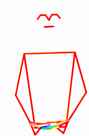
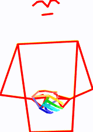

# Text-to-Pose

Text to pose model for sign language pose generation from a text sequence.

## Main Idea

This is a non-autoregressive pose sequence generator. Starting from a bad pose sequence, we would like to iteratively
refine it, by predicting for each frame the desired change.

For pretraining, this model can learn to refine any pose sequence, regardless of the text input. In fine-tuning, the
refinement process is conditioned on the text input.

#### Pseudo code:

```python
text_embedding = embed(text)
sequence_length = predict_length(text_embedding)
initial_pose_sequence = initial_frame.repeat(sequence_length)
while True:
    yield initial_pose_sequence
    refinement = predict_change(text_embedding, initial_pose_sequence)
    initial_pose_sequence += refinement
```

## Advantages:

1. Non-autoregressive, and therefore extremely fast (10 refinements, with batch size 32 in 0.15 seconds)
2. Controllable number of refinements - can try to refine the sequence in 1 step, or let it run for 1000
3. Controllable appearance - you control the appearance of the output by supplying the first pose
4. Composable - given multiple sequences to be generated and composed, use the last frame of each sequence to predict
   the next one
5. Consistent - always predicts all keypoints, including the hands
6. Can be used to correct a pose sequence with missing frames/keypoints


## Extra details

- Model tests, including overfitting, and continuous integration
- For experiment management we use WANDB
- Training works on CPU and GPU (90% util)
- Multiple-GPUs not tested


## Example

Given the following never-seen HamNoSys text sequence:


We predict the number of frames to generate (68) which is close to the reference number (66).

We use the first reference frame, expanded 68 times as a starting sequence to be refined iteratively.

|                | Reference                                        | Predicted                                                                                              | Predicted                                                                                           |
|----------------|--------------------------------------------------|--------------------------------------------------------------------------------------------------------|-----------------------------------------------------------------------------------------------------|
| Frames         | 66                                               | 68                                                                                                     | 68                                                                                                  |
| Starting Frame | N/A                                              | From [494_GSL](https://www.sign-lang.uni-hamburg.de/dicta-sign/portal/concepts/gsl/494.mp4) (Standing) | From [54_DGS](https://www.sign-lang.uni-hamburg.de/dicta-sign/portal/concepts/dgs/54.mp4) (Sitting) |
| Pose           |  |                                                                |                                                           |

This example was taken during training. The loss is still improving!